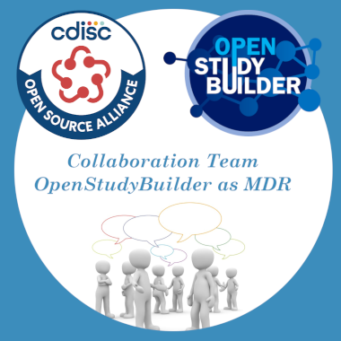

# OSB-MDR - Collaboration Team

This repository should be used for the *Collaboration team for the OpenStudyBuilder as MDR* project to contain code, minutes, notes, outcomes, discussions and more. It is meant to allow anyone working with the results and discussions to allow flexible collaboration and follow up projects.

## Description

This [CDISC Open Source Alliance](https://cosa.cdisc.org/) (COSA) collaboration group is created to support the utilization and modification of the [OpenStudyBuilder](https://openstudybuilder.com/) open source solution as a Metadata Repository (MDR). 

## Contribution

Contribution is very welcome. Please use Pull Requests and participate in the Wiki.

When you contribute to this repository you are doing so under the below licenses. Please checkout [Contribution](CONTRIBUTING.md) for additional information. All contributions must adhere to the following [Code of Conduct](CODE_OF_CONDUCT.md).

## License

 

### Code & Scripts

This project is using the [MIT](http://www.opensource.org/licenses/MIT "The MIT License | Open Source Initiative") license (see [`LICENSE`](LICENSE)) for code and scripts.

### Content

The content files like documentation and minutes are released under [CC-BY-4.0](https://creativecommons.org/licenses/by/4.0/). This does not include trademark permissions.

## Re-use

When you re-use the source, keep or copy the license information also in the source code files. When you re-use the source in proprietary software or distribute binaries (derived or underived), copy additionally the license text to a third-party-licenses file or similar.

When you want to re-use and refer to the content, please do so like the following:

> Content based on [OSB-MDR project (GitHub)](https://github.com/cdisc-org/osb-mdr) used under the [CC-BY-4.0](https://creativecommons.org/licenses/by/4.0/) license.

