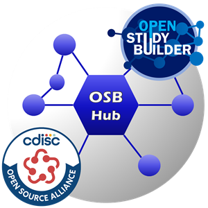

# OSB-Hub - Collaboration Team

The OpenStudyBuilder Hub (OSB-Hub) is a collaboration team under the umbrella of the CDISC Open Source Alliance (COSA). Our mission is to support the utilization and enhancement of the OpenStudyBuilder open-source tool. Here, we not only collect valuable feedback and use-cases but also actively run focused projects. Join us to drive innovation forward through both community engagement and project execution.

😊 Join us on Slack: [Invite](https://join.slack.com/t/osb-mdr/shared_invite/zt-2iwjqjg76-r0NW6pRH5GnGQQ~~izLc_A)

💡Feedback on Use-Cases: [Discussions](https://github.com/cdisc-org/osb-hub/discussions/categories/use-cases)

📚 Checkout information: [Wiki](https://github.com/cdisc-org/osb-hub/wiki)

## Description

This [CDISC Open Source Alliance](https://cosa.cdisc.org/) (COSA) collaboration team is created to support the utilization and modification of the [OpenStudyBuilder](https://openstudybuilder.com/) open source solution. 

## Use-Case definition & prioritize

We've curated a list of [use-cases](https://github.com/cdisc-org/osb-hub/discussions/categories/use-cases) awaiting your input to priories and expand this list. Your votes help prioritize our work at OSB-Hub these use-cases, guiding our efforts towards addressing the most critical needs. The results will feed into the OpenStudyBuilder project. Feel empowered to contribute additional use-cases and enrich existing ones with specific requirements. Engage in discussions, shaping the future of OpenStudyBuilder according to community insights. Together, we'll chart the course for our upcoming trails.

## OpenStudyBuilder Hub Trails (OSB-Hub-Trails)

We organize focused projects, known as OpenStudyBuilder Hub Trails, where we collaborate to develop documentation and best practices for applying specific use cases in real-life scenarios. These efforts may include creating supporting tools, such as those for import processes, and specifying additional requirements and concepts for potential integration into OpenStudyBuilder.

## Call for Members - OSB-Trail-ControlledTerminology

Our first OpenStudyBuilder trail focuses on the management of controlled terminology (CT), encompassing CDISC and sponsor standards. Delve into critical questions such as how to seamlessly integrate with new CDISC CT versions? How to load or create sponsor terminology? What kind of additional attributes can I apply? What would I need additionally? How to use this downstream? How to deal with different versions?

Focus | Description
-- | --
Timeline | July 2024 – December 2024
Outcome	| Documentation & best practices Supporting script(s) / tool(s) Additional requirements
Collaboration | Support documentation Join discussion and requirement collection Review documentation Create specifications & requirements Implement supporting tool, e.g. Excel interface / importer/exporter

## Contribution

Contribution is very welcome. Please use Pull Requests and participate in the Wiki and Discussions.

When you contribute to this repository you are doing so under the below licenses. Please checkout [Contribution](CONTRIBUTING.md) for additional information. All contributions must adhere to the following [Code of Conduct](CODE_OF_CONDUCT.md).

## License

 

### Code & Scripts

This project is using the [MIT](http://www.opensource.org/licenses/MIT "The MIT License | Open Source Initiative") license (see [`LICENSE`](LICENSE)) for code and scripts.

### Content

The content files like documentation and minutes are released under [CC-BY-4.0](https://creativecommons.org/licenses/by/4.0/). This does not include trademark permissions.

## Re-use

When you re-use the source, keep or copy the license information also in the source code files. When you re-use the source in proprietary software or distribute binaries (derived or underived), copy additionally the license text to a third-party-licenses file or similar.

When you want to re-use and refer to the content, please do so like the following:

> Content based on [OSB-MDR project (GitHub)](https://github.com/cdisc-org/osb-mdr) used under the [CC-BY-4.0](https://creativecommons.org/licenses/by/4.0/) license.

